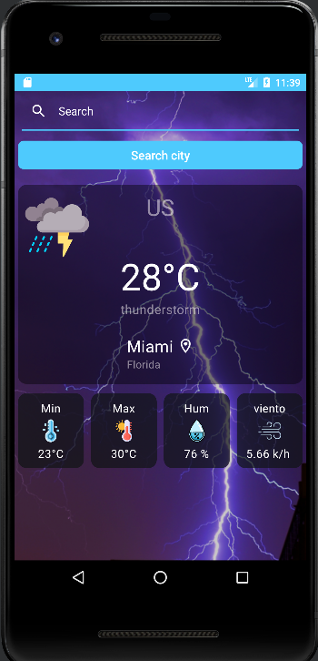

# ClimaApp

## Datos del Proyecto 
### Durante una prueba técnica, desarrollé una aplicación de pronóstico del tiempo utilizando la arquitectura MVVM, Clean Architecture, coroutines, Flow, inyección de dependencias y Jetpack Compose. Uno de los principales desafíos de la prueba fue integrar dos APIs diferentes: una para obtener el pronóstico del tiempo basado en coordenadas y otra para obtener información sobre países.En la aplicación, implementé el patrón MVVM (Modelo-Vista-ViewModel) para separar la lógica de negocio de la interfaz de usuario. Utilicé Clean Architecture para mantener una estructura modular y escalable, lo que facilitó la prueba y la extensibilidad del código.Para gestionar las tareas asíncronas y la concurrencia, utilicé coroutines, que son una forma sencilla y eficiente de manejar operaciones asíncronas en Kotlin. Combiné coroutines con el uso de Flow, que es una implementación basada en coroutines de la programación reactiva, para transmitir los datos de manera eficiente y reactiva en toda la aplicación.Además, utilicé la inyección de dependencias para proporcionar una forma flexible y desacoplada de gestionar las dependencias entre los diferentes componentes de la aplicación. Esto permitió una fácil configuración y reemplazo de las implementaciones de las dependencias.En cuanto a la interfaz de usuario, utilicé Jetpack Compose, el nuevo kit de herramientas de IU declarativo de Android. Compose me permitió crear una interfaz de usuario moderna y dinámica de forma más rápida y sencilla en comparación con las bibliotecas de vistas tradicionales.Uno de los principales desafíos fue integrar las dos APIs diferentes para obtener datos de pronóstico del tiempo y detalles de países. Tuve que manejar las solicitudes y las respuestas de las APIs de manera eficiente, procesar los datos recibidos y mostrarlos de forma adecuada en la interfaz de usuario.En general, la prueba técnica me permitió aplicar y demostrar mis conocimientos en desarrollo de aplicaciones móviles utilizando las últimas tecnologías y prácticas recomendadas. Aprendí a superar desafíos técnicos y a integrar múltiples fuentes de datos en una aplicación coherente y funcional.


## characteristics

- Layout with JetPack Compose
- coroutines and flow
- Dependency injection with Dagger Hilt
- MVVM (Model-View-ViewModel) architecture
- Clean Architecture


## Installation:

```
Dependencies{
    implementation 'androidx.core:core-ktx:1.7.0'
    implementation 'androidx.activity:activity-compose:1.3.1'
    implementation "androidx.compose.ui:ui:$compose_version"
    implementation "androidx.compose.ui:ui-tooling-preview:$compose_version"
    implementation 'androidx.compose.material3:material3:1.0.0-alpha15'
    testImplementation 'junit:junit:4.13.2'
    androidTestImplementation 'androidx.test.ext:junit:1.1.5'
    androidTestImplementation 'androidx.test.espresso:espresso-core:3.5.1'
    implementation 'androidx.compose.runtime:runtime-livedata:1.3.2'
    androidTestImplementation "androidx.compose.ui:ui-test-junit4:$compose_version"
    debugImplementation "androidx.compose.ui:ui-tooling:$compose_version"
    debugImplementation "androidx.compose.ui:ui-test-manifest:$compose_version"
    //Coroutines
    implementation 'org.jetbrains.kotlinx:kotlinx-coroutines-core:1.6.1'
    implementation 'org.jetbrains.kotlinx:kotlinx-coroutines-android:1.6.1'
    //DaggerHilt
    implementation "com.google.dagger:hilt-android:2.41"
    kapt "com.google.dagger:hilt-android-compiler:2.41"
    implementation "androidx.hilt:hilt-navigation-compose:1.0.0-alpha03"
    //Retrofit
    implementation 'com.squareup.retrofit2:retrofit:2.9.0'
    implementation 'com.squareup.retrofit2:converter-gson:2.9.0'
    //Coil
    implementation "io.coil-kt:coil-compose:2.0.0"
    //constrainLayout
    implementation "androidx.constraintlayout:constraintlayout-compose:1.0.1"
}
```


# Layout

## Screen



# APK

[APK ClimaAPP](https://drive.google.com/file/d/1mE_21z9Sfagts35O0dMKtHHr0EvOKbZQ/view?usp=sharing)
